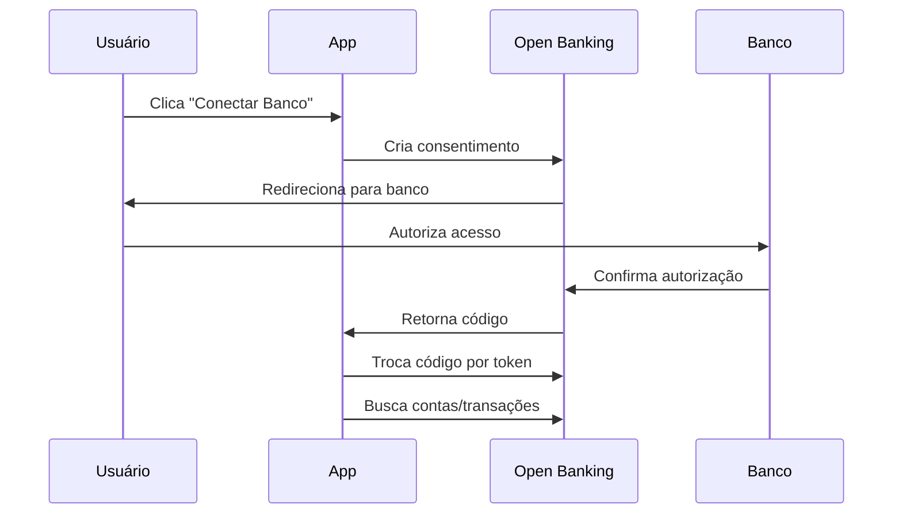
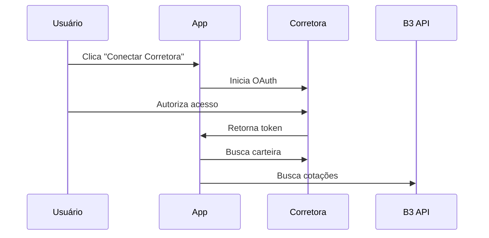

# Configuração de Integração Financeira

## Visão Geral

Este documento descreve como configurar as integrações com Open Banking Brasil e B3 para obter dados financeiros reais.

## Pré-requisitos

### 1. Credenciais Open Banking Brasil

Para integração com bancos via Open Banking:

```bash
# Variáveis de ambiente necessárias
OPEN_BANKING_CLIENT_ID=seu_client_id
OPEN_BANKING_CLIENT_SECRET=seu_client_secret
OPEN_BANKING_BASE_URL=https://matls-auth.sandbox.directory.openbankingbrasil.org.br
OPEN_BANKING_REDIRECT_URI=https://seudominio.com/connect/callback
```

**Como obter:**
1. Registre-se no [Diretório Open Banking Brasil](https://web.directory.openbankingbrasil.org.br/)
2. Crie uma aplicação e obtenha as credenciais
3. Configure os certificados mTLS necessários
4. Defina as URLs de redirecionamento

### 2. Credenciais para Dados da B3

Para cotações e dados de mercado:

```bash
# Opção 1: Yahoo Finance (gratuito, limitado)
# Não requer credenciais, mas tem rate limiting

# Opção 2: Alpha Vantage (freemium)
ALPHA_VANTAGE_API_KEY=sua_api_key

# Opção 3: B3 API Oficial (pago)
B3_API_KEY=sua_api_key
B3_API_SECRET=seu_api_secret
```

### 3. Configuração de Corretoras

Para integração com corretoras (APIs privadas):

```bash
# Clear Corretora
CLEAR_API_KEY=sua_api_key
CLEAR_API_SECRET=seu_api_secret

# XP Investimentos
XP_API_KEY=sua_api_key
XP_API_SECRET=seu_api_secret

# Rico Investimentos
RICO_API_KEY=sua_api_key
RICO_API_SECRET=seu_api_secret
```

## Configuração do Ambiente

### 1. Variáveis de Ambiente

Adicione ao arquivo `.env`:

```bash
# Open Banking
VITE_OPEN_BANKING_CLIENT_ID=seu_client_id
VITE_OPEN_BANKING_BASE_URL=https://matls-auth.sandbox.directory.openbankingbrasil.org.br
VITE_OPEN_BANKING_REDIRECT_URI=http://localhost:8080/connect/callback

# B3 / Cotações
VITE_B3_API_BASE_URL=https://api.b3.com.br
VITE_ALPHA_VANTAGE_API_KEY=sua_api_key

# Configurações de segurança
VITE_ENCRYPT_SENSITIVE_DATA=true
VITE_AUDIT_API_CALLS=true
```

### 2. Configuração do Supabase

Adicione as seguintes variáveis de ambiente no painel do Supabase:

```bash
# Open Banking (Edge Functions)
OPEN_BANKING_CLIENT_ID=seu_client_id
OPEN_BANKING_CLIENT_SECRET=seu_client_secret
OPEN_BANKING_BASE_URL=https://matls-auth.sandbox.directory.openbankingbrasil.org.br

# APIs de Cotações
ALPHA_VANTAGE_API_KEY=sua_api_key
B3_API_KEY=sua_api_key
B3_API_SECRET=seu_api_secret

# Configurações de segurança
ENCRYPT_SENSITIVE_DATA=true
LOG_LEVEL=INFO
```

## Fluxo de Integração

### 1. Open Banking (Bancos)



### 2. B3/Corretoras



## Implementação por Etapas

### Fase 1: Cotações em Tempo Real ✅
- [x] Integração com Yahoo Finance
- [x] Cache de cotações
- [x] Atualização automática
- [x] Tratamento de erros

### Fase 2: Open Banking (Em Desenvolvimento)
- [x] Estrutura base implementada
- [ ] Certificados mTLS
- [ ] Testes com bancos sandbox
- [ ] Importação automática de transações

### Fase 3: Carteiras de Investimento
- [x] Estrutura base implementada
- [ ] Integração com APIs de corretoras
- [ ] Sincronização de posições
- [ ] Cálculo de rentabilidade

### Fase 4: Funcionalidades Avançadas
- [ ] Análise de risco
- [ ] Recomendações de investimento
- [ ] Alertas personalizados
- [ ] Relatórios avançados

## Segurança e Compliance

### 1. LGPD (Lei Geral de Proteção de Dados)
- ✅ Consentimento explícito do usuário
- ✅ Criptografia de dados sensíveis
- ✅ Logs de auditoria
- ✅ Direito ao esquecimento

### 2. Regulamentações do Banco Central
- ✅ Conformidade com Open Banking Brasil
- ✅ Certificados digitais válidos
- ✅ Autenticação forte
- ✅ Monitoramento de transações

### 3. Boas Práticas de Segurança
- ✅ Tokens com expiração
- ✅ Rate limiting
- ✅ Validação de entrada
- ✅ Logs de segurança

## Monitoramento e Logs

### 1. Métricas Importantes
- Taxa de sucesso das conexões
- Tempo de resposta das APIs
- Erros por tipo
- Volume de dados processados

### 2. Alertas Configurados
- Falhas de conexão > 5%
- Tempo de resposta > 10s
- Erros de autenticação
- Limites de rate limiting atingidos

## Troubleshooting

### Problemas Comuns

1. **Erro de Consentimento Expirado**
   - Verificar validade do consentimento
   - Renovar autorização se necessário

2. **Cotações Não Atualizando**
   - Verificar rate limits
   - Validar símbolos dos ativos
   - Verificar status do mercado

3. **Carteira Não Carregando**
   - Verificar tokens de acesso
   - Validar credenciais da corretora
   - Verificar logs de erro

### Logs de Debug

Para habilitar logs detalhados:

```bash
# No ambiente de desenvolvimento
VITE_LOG_LEVEL=DEBUG

# No Supabase Edge Functions
LOG_LEVEL=DEBUG
```

## Contato e Suporte

Para questões técnicas sobre a integração:
- Email: dev@organiza.com
- Documentação: https://docs.organiza.com/integrations
- Status das APIs: https://status.organiza.com